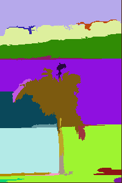
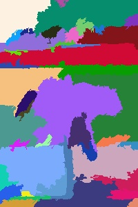
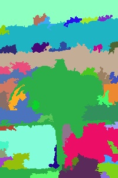
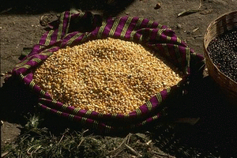
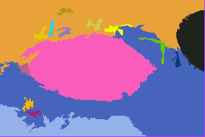
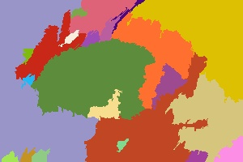

# Efficient Graph Based Image Segmentation *by Felzenszwalb*
## *A Python Implementation*

### Implemented paper
* Felzenszwalb and D. Huttenlocher. Efficient graph-based image segmentation. *IJCV*, 59(2), 2004.

### Language & packages
* Python 3.8
* opencv-python
* numpy
* scikit-learn
* matplotlib

### Results

* **Sample image 1: `beach.jpg`**

* Original image

* Author's implementation

> sigma: 0.5; k: 500; min_size: 50

* My implementation

> Grid-graph; sigma: 0.9; k: 700; min_size: 100

> Grid-graph; HSV color; sigma: 0.9; k: 1000; min_size: 100

> Nearest neighbor(KDTree); sigma: 0.9; k: 2000; min_size: 100; number of neighbors: 10

> Nearest neighbor(KDTree); HSV color; sigma: 0.9; k: 2000; min_size: 100; number of neighbors: 10

---

* **Sample image 2: `grain.jpg`**

* Original image

* Author's implementation

* My implementation

> Grid-graph; sigma: 0.9; k: 1500; min_size: 100

> Nearest neighbor(KDTree); HSV color; sigma: 0.9; k: 3000; min_size: 100; number of neighbors: 15

### Reference

* Refer to: [References.txt](References.txt)
